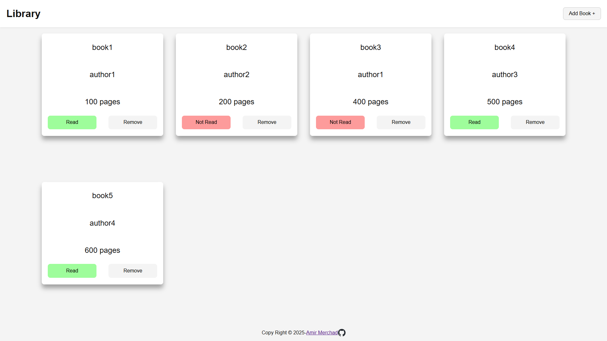

# 📚 Library Management App

[](https://developer.mozilla.org/en-US/docs/Web/HTML)  [](https://developer.mozilla.org/en-US/docs/Web/CSS)  [](https://developer.mozilla.org/en-US/docs/Web/JavaScript)   [](https://github.com/Amir-Merchad/JS-Library)

A simple and interactive personal library app built with vanilla JavaScript, HTML, and CSS.  
Add, remove, and toggle read status of your books using a clean UI with the HTML `<dialog>` element.

---

<p align="left">
  
</p>

---

## 🔍 Features

- Add books with title, author, page count, and read status
- Toggle book status between "Read" and "Not Read"
- Remove books from the library list
- Uses native HTML `<dialog>` for modal input
- Unique book IDs generated with `crypto.randomUUID()`
- Responsive and minimal design

---

## 🚀 Live Demo

[🔗 View Site](https://amir-merchad.github.io/JS-Library/)

---

## 🛠️ Technologies Used

| Technology       | Version | Notes                                       |
|------------------|---------|---------------------------------------------|
| HTML             | 5       | Semantic markup with dialog element         |
| CSS              | 3       | Flexbox, CSS variables for color palette    |
| JavaScript       | ES6+    | Classes, DOM manipulation, event handling   |
| Web APIs         | —       | `crypto.randomUUID()` for unique IDs        |
| Git / GitHub     | —       | Version control and project hosting         |

---

## 📁 Project Structure

~~~plaintext
calculator-app/
├── index.html
├── styles.css
├── script.js
├── README.md
└── images/
    ├── img.png
    └── github-mark.png
~~~
---

## 🧠 What I Learned

- Managing state in a JavaScript array
- Dynamically creating and updating DOM elements
- Handling user input with forms and validation
- Using the `<dialog>` element for modals
- Working with unique IDs to track items
- Event delegation for dynamically added elements

---

## 🧪 How to Run Locally

```bash
git clone https://github.com/yourusername/library-app.git
cd library-app
open index.html